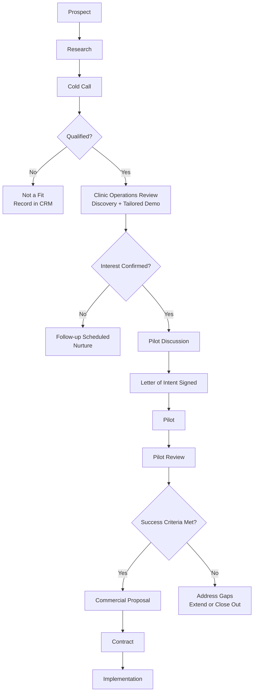
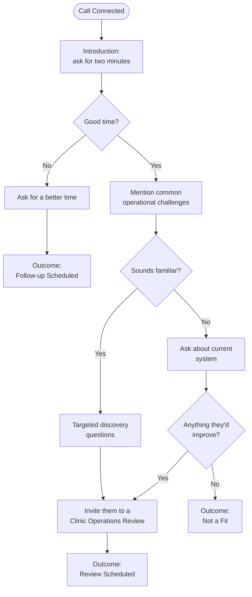
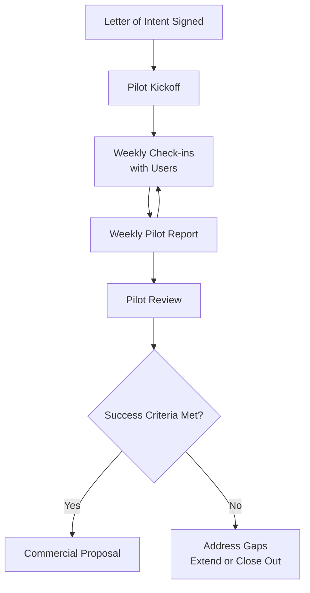

# Sigma Health Sales Playbook

*Version 2.0, Internal Use Only*

> "We do not sell software. We diagnose problems."

---

## Contents

1. [Welcome](#welcome)
2. [About Sigma Health](#about-sigma-health)
3. [The Sigma Story](#the-sigma-story)
4. [Why Clinics Choose Sigma](#why-clinics-choose-sigma)
5. [Your Role](#your-role)
6. [Our Ideal Customer](#our-ideal-customer)
7. [The Four Problems We Solve](#the-four-problems-we-solve)
8. [Our Sales Philosophy](#our-sales-philosophy)
9. [Sales Process](#sales-process)
10. [Stage 1: Prospecting](#stage-1-prospecting)
11. [Stage 2: Cold Calling](#stage-2-cold-calling)
12. [Selling to Multiple Stakeholders](#selling-to-multiple-stakeholders)
13. [Stage 3: Clinic Operations Review](#stage-3-clinic-operations-review)
14. [Follow-Up](#follow-up)
15. [Pilot Process](#pilot-process)
16. [CRM Standards](#crm-standards)
17. [Communication Principles](#communication-principles)
18. [Success Metrics](#success-metrics)
19. [Remember](#remember)

---

## Welcome

Welcome to Sigma. You are joining a company with a simple mission: help clinics deliver better healthcare by making their operations simpler, more transparent, and financially sustainable.

We are not in the business of selling software. We are in the business of solving operational and financial problems for healthcare providers. Every conversation you have should leave a clinic believing that Sigma understands their business.

**Your success will not be measured by how much you talk about the product. It will be measured by how well you understand the clinic's challenges, and how consistently you turn that understanding into signed pilots and closed deals.**

---

## About Sigma Health

### Who We Are

Sigma develops modern healthcare software for clinics and hospitals. Our flagship product, Sigma HMIS, is a complete Hospital Management Information System that brings together patient records, billing, pharmacy, laboratory, inventory, insurance claims, reporting, and financial visibility on a single platform.

Instead of multiple disconnected systems, spreadsheets, and paper records, clinics operate from one source of truth.

### Our Mission

To help healthcare providers operate more efficiently, improve financial visibility, and deliver better patient care through technology.

### Our Vision

To become Africa's most trusted healthcare management platform.

---

## The Sigma Story

Every clinic provides healthcare. But many clinics struggle to answer simple business questions:

- Which cash patients still owe us money?
- Which insurance companies still owe us money?
- Which claims have been rejected, and why?
- Why was this payment received?
- Which invoices has this insurance payment been settled against?
- How much revenue should we have collected this month?

When these questions cannot be answered quickly, cash flow suffers, finance teams spend hours reconciling payments, managers make decisions without complete information, and insurance claims are delayed or rejected.

Sigma was built to solve these operational challenges while providing a complete clinic management system. We believe clinics should spend their time caring for patients, not chasing paperwork.

---

## Why Clinics Choose Sigma

Clinics choose Sigma because it solves real operational challenges. Our customers consistently tell us they value:

**Better Financial Visibility**
- Who still owes money
- Outstanding co-payments
- Outstanding insurance balances
- Revenue collected vs. revenue outstanding

**Faster Insurance Reconciliation**
Match insurance payments to invoices without relying on spreadsheets.

**Lower Claim Rejections**
Identify rejected claims quickly and understand why they were rejected.

**Reliable Inventory Management**
Track medicine from procurement through dispensing, with real-time visibility into stock levels and consumption, including across multiple branches.

**One Integrated System**
Patient records, billing, pharmacy, laboratory, inventory, reporting, and insurance all work together.

### Social Proof

Healthcare organizations trust Sigma because we focus on solving real operational problems. We are proud to be working with organizations including MASM Mediclinics, where Sigma supports healthcare digitization and operational improvements. Every implementation strengthens our product through real-world feedback from healthcare professionals.

---

## Your Role

Your mission is simply to create opportunities. You are responsible for:

- Identifying clinics that may benefit from Sigma
- Building relationships
- Understanding their challenges
- Scheduling Clinic Operations Reviews
- Coordinating demonstrations
- Following up consistently
- Securing signed Letters of Intent for pilots
- Managing communication during pilots
- Producing weekly pilot reports
- Handing successful pilots to the implementation team

**You are not expected to:**
- Conduct technical demonstrations
- Configure the software
- Implement Sigma
- Provide technical support

---

## Our Ideal Customer

### Primary Targets

- Private clinics
- Mission hospitals
- Specialist clinics
- Multi-branch clinic groups
- Growing healthcare organizations

### Decision Makers

- Clinic Owners
- Medical Directors
- Hospital Administrators
- Practice Managers
- Finance Managers

Deals in multi-branch or hospital-scale organizations often involve more than one of these roles. See [Selling to Multiple Stakeholders](#selling-to-multiple-stakeholders) below.

### Buying Signals

Good prospects often show one or more of these characteristics:

- Paper-based records
- Heavy Excel usage
- Multiple disconnected systems
- Multiple branches that need centralized, consolidated visibility
- Slow billing processes
- Insurance claim challenges
- Manual payment reconciliation
- Poor financial visibility
- Difficulty generating management reports
- Frequent stock discrepancies or stockouts
- Difficulty tracking medicine consumption across branches
- Management cannot get a consolidated view of operations

### When to Disqualify

Not every clinic is the right fit today. Recognizing a poor fit early protects your pipeline quality and the clinic's time. Treat these as signals to close the opportunity out respectfully rather than push forward:

- Single-practitioner clinic with low patient volume and no plans to grow
- Fully satisfied with a current system, mid-way through a long-term contract, with no stated frustrations after discovery
- No one with budget authority is reachable or willing to engage
- Clinic operates on a cash-only basis with simple record-keeping needs and no interest in digitizing

A disqualified clinic still belongs in the CRM. Log the reason and revisit on a sensible cycle, for example in six to twelve months, or sooner if their circumstances change (new branch, new ownership, insurance panel changes).

---

## The Four Problems We Solve

These are the four most common reasons clinics choose Sigma.

### 1. Lack of Financial Visibility

Many clinics cannot easily answer:
- Who still owes co-payments?
- Which invoices remain unpaid?
- Which insurance companies still owe money?
- How much revenue is still outstanding?

Without this visibility, money is left uncollected, cash flow suffers, and management cannot make informed decisions.

### 2. Insurance Payment Reconciliation

Insurance providers often pay multiple invoices in a single payment. Finance teams spend hours matching payments to invoices, often using spreadsheets or manual processes. This makes it difficult to answer:
- Which invoices have been settled?
- Which payments are still outstanding?
- Has every payment been allocated correctly?

Sigma provides clear visibility into insurance payments and simplifies reconciliation.

### 3. Insurance Claim Rejections

Rejected claims delay payments and reduce cash flow. Many clinics struggle to identify:
- Why claims were rejected
- Which insurers reject the most claims
- Common rejection patterns
- Which claims require follow-up

Sigma gives clinics better visibility into the claims process, helping them identify issues earlier and improve claim success rates.

### 4. Inventory Management

Many clinics struggle to maintain accurate inventory records. Common challenges include:
- Unexpected stockouts
- Medicines expiring on the shelf
- Stock losses that cannot be explained
- Difficulty knowing which branch has available stock
- Manual stock counts and reconciliations
- Poor visibility into medicine consumption

Without reliable inventory management, clinics lose money, interrupt patient care, and spend unnecessary time investigating discrepancies. Sigma enables clinics to track medicines from procurement through dispensing, giving management real-time visibility into stock levels, movements, and consumption across one or multiple branches.

### Putting a Number on the Problem

Pain is more persuasive when it has a number attached. Where the clinic shares enough detail in discovery, help them do quick, rough math on the cost of the status quo, always using their own figures, never invented ones:

- Outstanding co-payments × average age of debt → approximate cash tied up in uncollected balances
- Claim rejection rate × average claim value → approximate revenue at risk per month
- Hours spent on manual reconciliation per week × loaded staff cost → approximate administrative cost per year

This is a conversation aid, not a formal ROI model. Keep it simple, keep it their numbers, and use it to justify a Clinic Operations Review, not to close a sale on the spot.

---

## Our Sales Philosophy

We do not sell software. We diagnose problems.

- Every clinic is different; never assume their biggest challenge
- Ask questions first, understand their workflow, then demonstrate how Sigma solves their specific problems
- Listen more than you speak
- Never demonstrate before understanding the clinic
- Focus on business outcomes, not software features
- Every conversation must end with a next step
- Every opportunity must be recorded in the CRM
- Every pilot must have measurable objectives
- Every follow-up should add value
- Build trust before asking for commitment
- Never promise functionality that does not exist
- Remember that we are helping clinics improve patient care by improving how they operate

People rarely buy software because it has more features. They buy because they believe it will solve a problem that matters to them.

Your job is not to convince every clinic that Sigma is great. Your job is to discover which clinics have problems that Sigma is uniquely positioned to solve, help them see a better way of operating, and guide them confidently toward becoming long-term Sigma customers.

*When you focus on understanding first and selling second, you'll build trust, create stronger relationships, and consistently bring the right clinics into the Sigma community.*

---

## Sales Process

The stages below are sequential. The expected duration is a planning guide for forecasting and spotting stalled deals, not a script to rush a clinic through.

| Stage | Typical Duration | Exit Criteria |
|---|---|---|
| Prospecting & Research | Ongoing | Decision maker and contact details identified |
| Cold Call | 1–2 calls | Clinic Operations Review booked, or disqualified |
| Clinic Operations Review | 1 week to schedule | Interest confirmed; challenges documented |
| Pilot Discussion | 1–2 weeks | Objectives and scope agreed |
| Letter of Intent | 1 week | Signed by clinic |
| Pilot | 4–6 weeks | Success criteria met or not met |
| Pilot Review → Commercial Proposal | 1–2 weeks | Proposal delivered |
| Contract → Implementation | 2–4 weeks | Signed contract; handed to implementation team |

If a deal sits in one stage well beyond its typical duration, treat that as a signal to re-engage the champion, revisit objectives, or confirm the opportunity is still live. It is not a reason to let it quietly age in the CRM.

---

## Stage 1: Prospecting

Every week you should be identifying new clinics. Research:

- Decision maker
- Number of branches
- Services offered
- Current software
- Insurance providers accepted
- Phone number and email
- Location

Aim to maintain a healthy pipeline. Never rely on only a few opportunities.

---

## Stage 2: Cold Calling

### Objective

The objective of every cold call is to secure a Clinic Operations Review.

- Do not try to sell Sigma over the phone
- Do not explain every feature
- Do not conduct a discovery session that lasts twenty minutes

Your goal is simply to determine whether the clinic has operational challenges that warrant a face-to-face conversation. A successful call ends with a scheduled meeting.

### Cold Call Flow

### Step 1: Introduction

> "Good morning. My name is [Name], and I'm calling from Sigma. We help clinics improve financial visibility, simplify insurance claims, and better manage their day-to-day operations. Is this a good time for a quick two-minute conversation?"

**If they say yes**

> "Thank you, I appreciate it. Through our work with healthcare providers, we've found that a few operational challenges come up repeatedly: insurance claim rejections, delays in receiving insurance payments, difficulty reconciling insurance payments, limited visibility into outstanding patient and insurance balances, inventory management challenges, and paper-based record keeping that can create compliance risks. I'm curious, do any of these sound familiar to your clinic?"

Pause. Let them answer. Do not interrupt.

**If they say no**

> "I completely understand. When would be a better time for me to call you back?"

If they provide a time: "Perfect. I'll give you a call then. Thank you, and have a great day."

If they don't know: "No problem at all. Would it be alright if I tried again later this week?"

Never try to continue the sales conversation after they've said they don't have time. Respecting their time builds trust.

### Step 2: Discovery

The purpose of discovery is to understand the clinic, not to qualify every detail. Ask only the questions that relate to the challenges they mention.

**If they mention claim rejections**
- Which insurance providers do you work with?
- How often do claims get rejected?
- Do you know the most common reasons for rejection?

**If they mention delayed insurance payments**
- How do you currently keep track of outstanding insurance payments?
- How long does it typically take before insurers settle claims?
- How do you follow up on unpaid claims?

**If they mention payment reconciliation**
- How do you currently match insurance payments to invoices?
- Is that process manual or system-based?
- How much time does that usually take?

**If they mention financial visibility**
- How do you know which patients still owe co-payments?
- How do you know which insurance providers still owe your clinic money?

**If they mention inventory**
- How do you currently manage your medicine inventory?
- Have you experienced stock discrepancies or stockouts?
- Do you manage inventory across multiple branches?

**If they mention paper records**
- Are all departments still paper-based?
- Have you considered digitizing some of those processes?

**If they say "No, we don't have those issues"**

Avoid arguing. Stay curious.

> "That's great to hear. Out of curiosity, how are you currently managing your clinic operations? Are you using any system?"

If they have software: "That's good to know. What do you like most about your current system? If there was one thing you could improve about it, what would it be?" Almost every customer has something they'd like to improve.

### Step 3: Transition to the Clinic Operations Review

Once you've identified one or more challenges, keep the invitation conversational. Don't name the meeting formally; describe what you'll actually do together:

> "Thank you for sharing that. From what you've told me, we'd like to come and understand how your clinic currently operates, and then tailor a demonstration around the challenges you've shared. It's a focused conversation, about an hour, and it's specific to your clinic rather than a generic walkthrough. Would next Tuesday or Wednesday work better for you?"

**If they want a demo immediately**

> "We'd be happy to. To make the best use of your time, we usually spend the first few minutes understanding how your clinic currently operates, so we can tailor the demonstration to what matters most to you rather than walking through features that may not be relevant."

**If they ask "how much does it cost?"**

Don't dodge the question entirely; that costs you credibility. Give an honest, general sense of scale, then bring them back to the conversation:

> "It varies with the size of the clinic and which modules you need, but as a rough sense of scale, most single-branch clinics land in [insert current entry-level range] per month, and multi-branch groups scale up from there. Once we understand your setup, we can confirm exactly which modules you need and give you an accurate number rather than a generic one."

*Confirm the current entry-level range with your sales manager before quoting it; it should stay current with published pricing.*

### Ending Every Call

Every call should end with one of three outcomes:

- Outcome 1, Clinic Operations Review Scheduled: meeting date and time confirmed
- Outcome 2, Follow-up Scheduled: a specific day and time agreed for another call
- Outcome 3, Not a Fit: the clinic clearly does not meet our target profile (see [When to Disqualify](#when-to-disqualify))

Record the outcome in the CRM and move on.

### General Discovery Questions

Ask questions. Listen more than you speak.

- How do patients register today?
- How do you currently bill patients?
- How do you manage insurance claims?
- How do you reconcile insurance payments?
- How do you know who still owes co-payments?
- How do you generate management reports?
- What takes the most staff time?
- If you could improve one process tomorrow, what would it be?

---

## Selling to Multiple Stakeholders

In multi-branch groups and hospitals, more than one decision maker is usually involved, and they don't all care about the same things. Recognizing each person's lens early prevents a deal from stalling after a good demo.

| Role | Primarily Cares About |
|---|---|
| Clinic Owner | Overall ROI, growth, competitive position |
| Medical Director | Patient care quality, clinical workflow disruption |
| Hospital Administrator | Operational efficiency, staff adoption, rollout risk |
| Practice Manager | Day-to-day usability, training effort |
| Finance Manager | Cash flow, reconciliation accuracy, cost of ownership |

Practical guidance:

- Identify early in discovery who else needs to be involved before a pilot can be approved
- Where possible, involve both a clinical and a financial stakeholder in the Clinic Operations Review; a demo that only satisfies one side often stalls at the proposal stage
- If stakeholders disagree, don't take sides. Acknowledge both sets of priorities and confirm how Sigma addresses each
- Record every stakeholder and their specific concerns in the CRM, not just the primary contact

---

## Stage 3: Clinic Operations Review

This is not called a sales presentation. Internally, we call it a Clinic Operations Review.

*That internal name is for our own process language: CRM stages, reporting, and training. When speaking with a clinic, keep it conversational rather than naming it formally. Describe what will happen, not the label for it, for example: "we'd like to come and understand how your clinic currently operates, and then tailor a demonstration around the challenges you've shared." This lowers resistance while achieving the same objective.*

### Agenda

**Part 1: Discovery (15 minutes)**
Understand current workflow, current software, pain points, insurance process, financial reporting, and desired improvements.

**Part 2: Tailored Demonstration (35–45 minutes)**
Only demonstrate modules that solve their biggest challenges. If they struggle with insurance reconciliation, show reconciliation, not ten minutes on laboratory workflows. Focus on solving today's problems.

**Part 3: Next Steps**
Agree on outstanding questions, pilot discussion, decision makers still to involve, timeline, and the next meeting. Every meeting must end with a clear next action.

### Demonstration Principles

- Never demonstrate every module
- Never overwhelm the customer
- Never click through features just because they exist

Follow this flow instead:

### Objection Handling

**"We already have software."**
> "That's great. Most clinics we speak with already have some form of system. What would you say works well today, and what still creates frustration?"

**"We're too busy."**
> "I completely understand. That's actually one of the reasons many clinics decide to meet with us: they're looking for ways to reduce administrative work."

**"We don't have budget."**
> "I understand. Before we discuss investment, would it be helpful to understand whether Sigma could reduce claim rejections or improve payment collection?"

**"Send me a brochure."**
> "I'd be happy to. Before I do, may I ask one question so I can send the most relevant information?"

---

## Follow-Up

Every interaction should end with a next step.

- Book a Clinic Operations Review
- Schedule a pilot discussion
- Arrange another meeting
- Request additional stakeholders

Never leave the next step undefined.

---

## Pilot Process

The pilot is not a free trial. It is a structured evaluation.

### Objectives

- Validate Sigma within the clinic
- Measure improvements
- Collect user feedback
- Build confidence
- Prepare for full implementation

### Pilot Flow

### Defining Pilot Success

Agree on specific, measurable success criteria before the pilot begins, tied to the problems identified in discovery. Vague goals like "build confidence" are hard to evaluate at Pilot Review. Examples by problem area:

| Problem Area | Example Success Criterion |
|---|---|
| Financial visibility | Outstanding balances reconciled and reported within [X] business days |
| Insurance reconciliation | Reduction in average reconciliation time per payment batch |
| Claim rejections | Reduction in claim rejection rate, or faster identification of rejection reasons |
| Inventory management | Reduction in stockouts or unexplained stock discrepancies at pilot branches |
| User adoption | A defined share of relevant staff actively using the system by pilot end |

Set the specific numeric targets with the clinic during the Pilot Discussion. They should reflect that clinic's baseline, not a generic company-wide target.

### Letter of Intent

Before every pilot, ensure:

- Objectives and success criteria are agreed
- Pilot duration is understood
- Responsibilities are documented
- Letter of Intent is signed

### During the Pilot

- Maintain regular communication
- Check in with users
- Record feedback
- Identify risks early
- Celebrate successes
- Escalate issues quickly

### Weekly Pilot Report

Every report should include:

- Clinic name and reporting period
- Activities completed
- User adoption
- Progress against agreed success criteria
- Successes
- Challenges
- Actions taken
- Risks
- Plans for next week

---

## CRM Standards

Every interaction must be recorded. Capture:

- Decision makers and other stakeholders
- Pain points
- Current software and workflow
- Insurance providers
- Meeting notes
- Next action
- Expected close date
- Pilot status

Never rely on memory.

---

## Communication Principles

Always be:

- Professional
- Helpful
- Curious
- Honest
- Responsive

Never pressure customers. Never exaggerate. Always focus on solving problems.

---

## Success Metrics

**Daily**
- New clinics researched
- Cold calls completed
- Meaningful conversations
- Follow-up messages sent

**Weekly**
- Clinic Operations Reviews booked and completed
- Pilots proposed
- Letters of Intent signed
- Active pilots managed
- Weekly pilot reports submitted

**Monthly**
- Pilots started and converted
- New customers
- Revenue generated
- Average sales cycle, by stage (see [Sales Process](#sales-process) durations)

---

## Remember

*Listen more than you speak. Diagnose before you demonstrate. Every conversation earns the next step, and every clinic you help operate better is a clinic that can spend more of its time on patient care.*